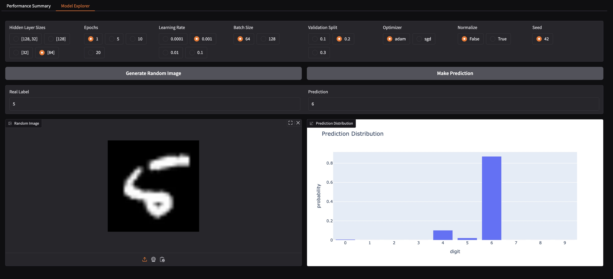

# MNIST Model Explorer

This repo provides a command line tool designed to faciliate the training and exploration of neural network models on the MNIST dataset. After training a family of networks using different hyperparameters, the user can visualize the performance of these models using a Gradio-backed app provided.

1. [Example Screenshots](#example-screenshots)
2. [Overview](#overview)
    1. [Command-Line Interface](#command-line-interface)
        1. [Train](#train)
        2. [Explore](#explore)
3. [Code Structure](#code-structure)
    1. [Training Process](#training-process)
    2. [Exploration Process](#exploration-process)

## Example Screenshots

View of the performance summary page in app:


View of the model explorer page in app:


## Overview

The tool consists of two main components:

1. **Train**: Train a neural network on the MNIST dataset with a set of custom hyperparameters.
2. **Explore**: Visualize the performance of trained models using a Gradio server.

### Command-Line Interface

The CLI is built using `argparse` and supports two subcommands: `train` and `explore`.

#### Train

The `train` subcommand allows you to train a neural network with the following parameters:

- `--epochs`: (Default = `10`) Number of epochs for training.
- `--learning-rate`: (Default = `0.001`) Learning rate for training.
- `--batch-size`: (Default = `64`) Batch size for training.
- `--val-split`: (Default = `0.1`) Validation split for training.
- `--hidden-layer-sizes`: (Default = `[84]`) Hidden layer sizes for the neural network.
- `--optimizer`: (Default = `adam`) Optimizer for training; either `adam` or `sgd`.
- `--normalize`: (Default = `True`) Normalize the data.
- `--force-retrain`: (Default = `False`) Force retrain the model for all parameters.
- `--random-seed`: (Default = `42`) Random seed for reproducibility.
- `--data-dir`: (Default = `data`) Directory to store MNIST data.
- `--model-dir`: (Default = `models`) Directory to store trained model data.

Note each numerical hyperparameter supports a list of values, so one command can train multiple models in one run.

Example usage:
```
# Train a neural network with hidden layer sizes 256 and 84 with 10 epochs 
# and using each pair of given learning rates / batch sizes
# Results in 4 models trained total in one command
python mnist-explorer.py train --epochs 10 --learning-rate 0.001 0.01 --batch-size 64 256 --hidden-layer-sizes 256 84
```

For each model trained, three files will be produced, with model name generated from the hyperparameters:
- `model_name.pt`: The trained model PyTorch weights.
- `model_name-loss.csv`: Table of loss values computed during training, including on validation data.
- `model_name-performance.csv`: Table of accuracy and runtime metrics computed on test data.

#### Explore

The `explore` subcommand starts a Gradio server to visualize the performance of trained models. It supports the following parameters:

- `--port`: (Default = `7860`) Port for the Gradio server.
- `--random-seed`: (Default = `42`) Random seed for reproducibility when generating images.
- `--share`: (Default = `False`) Share the Gradio server publicly on temporary URL.
- `--data-dir`: (Default = `data`) Directory where MNIST data is stored.
- `--model-dir`: (Default = `models`) Directory where trained model data is stored.

Example usage:
```
python mnist-explorer.py explore --port 7860
```

## Code Structure

### Training Process

The training process involves the following steps:

1. **Data Preparation**: Load and preprocess the MNIST dataset.
2. **Model Training**: Train the neural network with specified hyperparameters.
3. **Model Evaluation**: Evaluate the model on the validation set and record performance metrics.
4. **Model Saving**: Save the trained model and performance metrics to the specified directory.

### Exploration Process

The exploration process involves the following steps:

1. **Model Loading**: Create `ModelStore` object to hold information managing existing models in provided directory.
2. **Gradio App**: Start a Gradio server to visualize model performance and interact with the models in the `ModelStore`.
